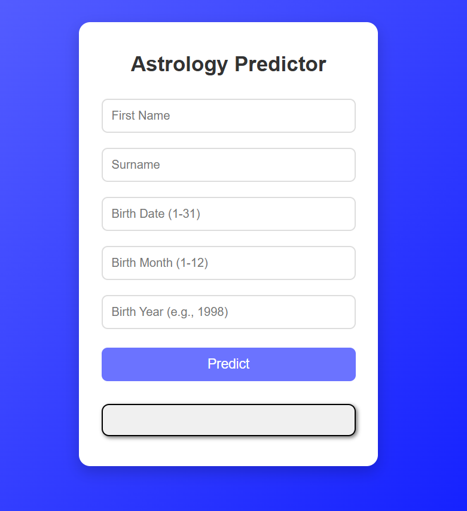

# Astrology Predictor
A web-based Astrology Predictor application built with HTML, CSS, and JavaScript. This page allows users to input their birth details (name, date, month, year) and receive a prediction.

✨ Features
User Input Form: Collects first name, surname, birth date, birth month, and birth year.

Prediction Display: Shows a prediction based on the entered details.

Clean UI: A straightforward and easy-to-use interface.

🚀 Technologies Used
HTML5: Provides the structure for the input form and prediction display.

CSS3: Styles the page for an appealing and user-friendly layout.

JavaScript: Handles form input, processes the data, and generates/displays the astrological prediction.

💻 How to Use
To run this project locally, follow these simple steps:

Open index.html:
Simply open the index.html file in your preferred web browser.

Enter Your Details:
Fill in the required fields: First Name, Surname, Birth Date (1-31), Birth Month (1-12), and Birth Year (e.g., 1998).

Get Your Prediction:
Click the "Predict" button to see your astrological prediction.

📸 Screenshot

💡 Future Enhancements (Optional Ideas)
Implement more sophisticated astrological calculations for predictions.

Integrate with an external astrology API for more accurate or diverse predictions.

Add client-side validation for input fields (e.g., ensuring valid date/month ranges).

Improve the design and add animations.

Allow users to select their birth time and location for more precise predictions.

📄 License
This project is open-source and available under the MIT License.